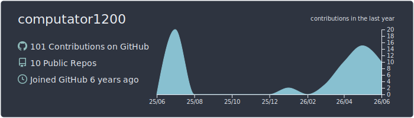
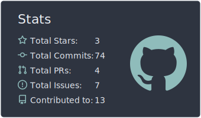
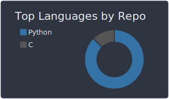
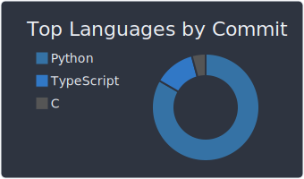
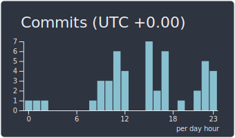

# 🌐 Shaan | computator1200
### **Digital Archaeologist & Systems Architect**

  

  
  

  
  

---

## 🛰️ Transmission Information
*   **Age:** 20 (Born 2005)
*   **Coordinates:** London, UK (Student at Queen Mary, University of London)
*   **Background:** Born and raised in Dubai (Pakistani heritage) — a hybrid of multicultural perspectives and early internet nostalgia.
*   **Archetype:** Analytical senior-level power user. I bridge the gap between abstract mathematical intuition and low-level system mechanics.

---

## 🛠️ The Technical Vault
I don't just write code; I orchestrate systems. I specialize in automation, high-efficiency workflows, and self-hosted infrastructure.

### **Languages & Frameworks**
*   **Primary:** Python (FastAPI, Nuitka, Automation), Rust (Cargo), C++ (Performance).
*   **Web/Data:** React, Next.js (BFF Pattern), Node.js (fnm), MongoDB.
*   **System:** PowerShell, Shell scripting, Windows power-user diagnostics.

### **Infrastructure & Self-Hosting**
*   **Hybrid Architecture:** Local Media Server (Ryzen 7 7700X, RTX 4070 Ti) bridged with Debian VPS via Tailscale.
*   **Media Stack:** Jellyfin, Dockerized *arr suite (Sonarr/Radarr), and custom Usenet pipelines.
*   **Automation:** JIT Usenet streaming, automated disk management, and P2P efficiency tools.

---

## 🏗️ Public Works
*   [**RED-autosnatch**](https://github.com/computator1200/RED-autosnatch-top-100-with-tokens) - Automated FL token management for Redacted.sh.
*   [**MAL-List-Editor**](https://github.com/computator1200/MAL-List-Editor) - A comprehensive editor for MyAnimeList addicts.
*   [**osu-lazer-beatmap-import**](https://github.com/computator1200/osu-lazer-beatmap-import) - C-based utility for beatmap migrations.
*   [**ecoweatherfit**](https://github.com/computator1200/ecoweatherfit) - Sustainable weather-based clothing recommendation engine.
*   [**gta-afk**](https://github.com/computator1200/gta-afk) - Python-based AFK automation for long sessions.

---

## 🏺 Digital Archaeology & Interests
I possess a deep sense of **anemoia** — a profound nostalgia for the 80s, 90s, and early 2000s web. I value the high-barrier-to-entry nature of the early internet.

*   **Anime/Otaku Culture:** Deep interest in Seinen, Psychological Thrillers, and Dystopian narratives. I appreciate the analytical dedication of old-school fans.
*   **Math & Science:** I love the first-principles derivation of Gaussian distributions, game theory (Mastermind), and PCA dimensionality reduction.
*   **Philosophy:** Practical, logical, and empathy-driven. I value unconditional compassion and have a strong line against utilitarian hypocrisy.
*   **Gaming:** GTA V Online, Rocket League, R6 Siege. I prefer building my own automation tools for these games over using hardware macros.

---

## 📬 Connectivity
*   **WPM:** 110 (Fast-typing "lurker" turned contributor)
*   **Philosophy:** "Burn bright, burn fast" — I bond intensely with projects and people, valuing deep, honest communication.

  

