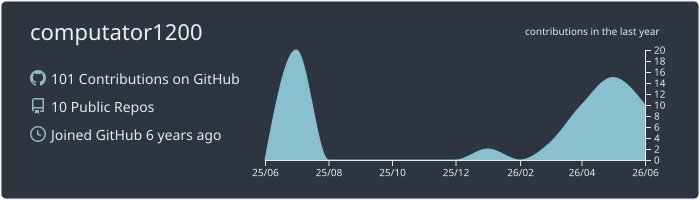
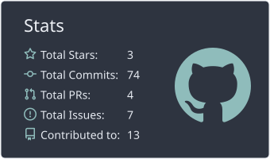
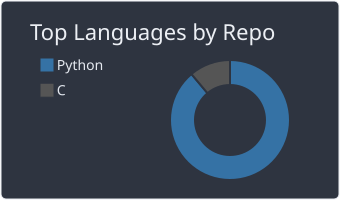

# computator1200

**Automation · backend services · applied ML**

  

  
  

---

I build tools that do an actual job: API integrations that hold up under real
traffic, bots and adapters that speak awkward protocols properly, and ML models
that get wired into something usable instead of being left in a notebook.
Mostly Python, occasionally C when something needs to be genuinely fast.

---

## 🔧 Featured Projects

### [hermes-ircx-plugin](https://github.com/computator1200/hermes-ircx-plugin) — IRCv3 platform adapter
A platform adapter that speaks IRCv3 properly: full SASL (PLAIN / EXTERNAL /
SCRAM), CHATHISTORY persistence, observe-mode operation and runtime channel
agency. CI runs on every push; 91 tests passing, MIT licensed.

`Python` · `IRCv3` · `SASL` · `pytest` · `GitHub Actions`

### [Music-recommender](https://github.com/computator1200/Music-recommender) — two recommendation paradigms, one system
Collaborative filtering implemented as an autoencoder that reconstructs the
user–item interaction matrix, alongside content-based retrieval built on a
two-tower model that embeds tracks into a latent space for k-nearest-neighbour
queries.

`Python` · `TensorFlow` · `Autoencoders` · `Two-tower retrieval`

### [ecoweatherfit](https://github.com/computator1200/ecoweatherfit) — forecasting pipeline with guardrailed generation
7-day weather forecasting from a Random Forest baseline and an LSTM trained on
historical Meteostat data, combined with live OpenWeatherMap integration. The
recommendation layer generates conversational output but is clamped behind
deterministic heuristics so it cannot invent advice — a small case study in
letting a model be useful without letting it hallucinate.

`scikit-learn` · `LSTM` · `FastAPI` · `guardrails`

### [RED-autosnatch](https://github.com/computator1200/RED-autosnatch-top-100-with-tokens) — API automation with real accounting
Discovers high-value torrents across categories, filters out anything already
snatched or seeding, tracks token spend down to the last unit, and hands off to
qBittorrent. Written against a live third-party API, so it carries the failure
handling that implies.

`Python` · `REST APIs` · `Automation`

---

## ⚙️ Also on the workbench

- **[gemini-subagent](https://github.com/computator1200/gemini-subagent)** — A Claude Code skill for delegating work to the Gemini CLI headlessly. Encodes three patterns: single-shot delegation, genuinely parallel co-development against a frozen contract, and live ACP steering with mid-flight cancellation. Design goal was keeping intermediate traces out of the parent agent's context entirely.
- **[osu-lazer-beatmap-import](https://github.com/computator1200/osu-lazer-beatmap-import)** — Native C utility using libzip to batch-import large beatmap collections, with pause/resume, graceful signal handling and per-file error logging.
- **[IEUK-2025-Engineering-Sector-Skills-Project](https://github.com/computator1200/IEUK-2025-Engineering-Sector-Skills-Project)** — Server log analysis separating human from non-human traffic, and quantifying the downtime cost to a three-person engineering team.
- **[ZTE-MC888-ddns-updater](https://github.com/computator1200/ZTE-MC888-ddns-updater)** — Polls a router's admin API and repairs its dynamic DNS registration when it silently drops, keeping a remote tunnel reachable.
- **[MAL-List-Editor](https://github.com/computator1200/MAL-List-Editor)** — Bulk list editor for MyAnimeList.
- **[gta-afk](https://github.com/computator1200/gta-afk)** — Input-simulation utility driving a virtual controller, with hotkey toggling and clean shutdown.

---

## 🛠️ Toolbox

- **Languages:** Python · C · Rust · C++ · JavaScript · PowerShell
- **Backend & web:** FastAPI · Node.js · React · Next.js
- **Data & ML:** TensorFlow · scikit-learn · Pandas
- **Infrastructure:** Docker · Linux · GitHub Actions · self-hosted services

---

  

